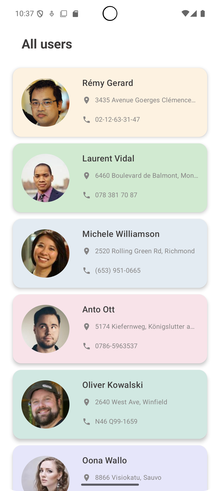
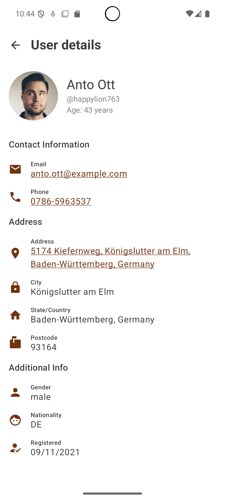
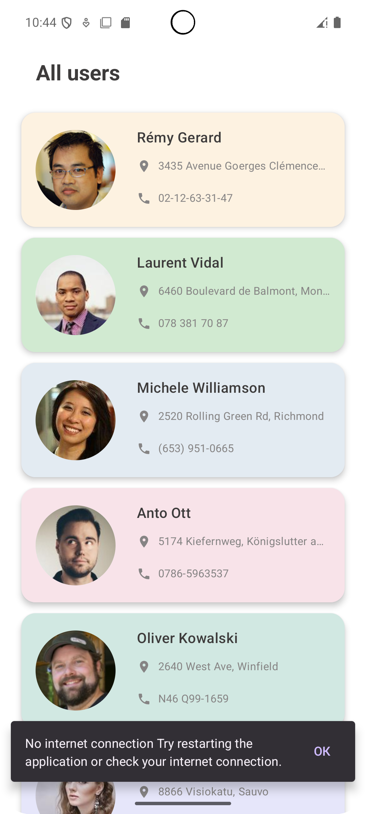

# 👥 User List App

[](https://kotlinlang.org)  
[](https://developer.android.com/jetpack/compose)  
[](https://android-arsenal.com/api?level=21)

Приложение для отображения списка пользователей с API [randomuser.me](https://randomuser.me), реализованное с использованием Clean Architecture, MVVM и Jetpack Compose. Поддерживается кэширование, обновление данных, переход по email, телефону и адресу.

---

## 📱 Демонстрация

<div align="center">
  
  
  
</div>

---

## 🚀 Ключевые возможности

### 📋 Список пользователей
- Краткая информация: имя, фото, адрес, телефон
- Поддержка свайп-обновления

### 👤 Детальный экран
- Полная информация о пользователе
- Интенты:
  - Email → почтовое приложение
  - Телефон → набрать номер
  - Адрес → открыть в картах

### 💾 Локальное хранение
- Данные кэшируются в Room
- Не теряются при перезапуске приложения

### 🛠️ Обработка ошибок
- Snackbar при ошибках загрузки
- Обработка состояний загрузки и обновления

---

## ⚙️ Технологический стек

### Ядро
- **Kotlin**
- **Jetpack Compose**
- **Material Design 3**

### Архитектура
- **Clean Architecture**
- **MVVM + StateFlow**

### DI & Data
- **Hilt** — внедрение зависимостей
- **Retrofit + Gson** — загрузка пользователей с randomuser.me
- **Room** — локальное кэширование данных
- **Coil** — загрузка изображений

---

## 🧠 Архитектурные особенности

- **Clean Architecture** — деление на `data`, `domain`, `presentation`
- **MVVM** — управление состоянием и логикой отображения
- **Room + Coroutines** — асинхронное локальное хранение
- **Hilt** — автоматическое внедрение зависимостей
- **Navigation Compose** — безопасная навигация между экранами

---

## 🔧 Инструкция по запуску проекта

1. Установите Android Studio Arctic Fox или новее
2. Клонируйте проект:
```bash
git clone https://github.com/your-username/user-list-app.git
